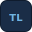
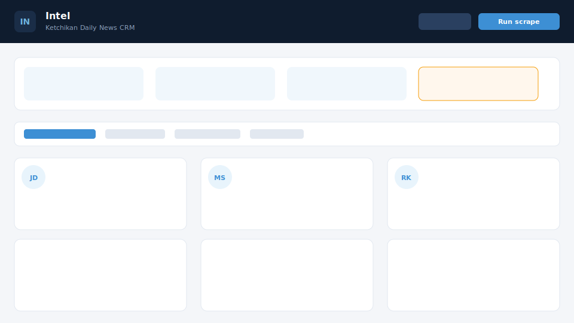

<div align="center">



# Throughline

**Your through line from local news to CRM**

Scrape your local paper, extract people with AI, summarize articles, and review contacts in a polished dashboard — with a REST API built for CRM integration.

[](https://github.com/TheMitchyBoy/Throughline/actions/workflows/ci.yml)
[](https://www.python.org/)
[](https://fastapi.tiangolo.com/)
[](https://react.dev/)
[](LICENSE)

[Quick start](#quick-start) · [Dashboard](#crm-dashboard) · [API](#rest-api) · [Architecture](docs/ARCHITECTURE.md) · [Deploy on Railway](RAILWAY.md)

</div>

---

<p align="center">
  
</p>

## What it does

Throughline turns local newspaper coverage into structured CRM-ready contact data:

1. **Scrapes** configurable RSS/HTML sources (`config/newspapers.yaml`)
2. **Summarizes** articles with OpenAI into concise local-news briefs
3. **Extracts people** using spaCy NER, headline parsing, and AI — merged with confidence scoring
4. **Deduplicates** mentions into canonical contacts across articles
5. **Reviews** low-confidence names in a human queue (confirm, reject, rename typos)
6. **Exposes a REST API** for your CRM to poll, plus optional webhook push

Ketchikan Daily News is pre-configured. Point the config at your own paper to get started.

## Tech stack

| Layer | Technology |
|-------|------------|
| Backend | Python 3.12, FastAPI, SQLAlchemy 2, APScheduler |
| AI | OpenAI GPT, spaCy `en_core_web_sm` |
| Database | PostgreSQL 15+ |
| Frontend | React 19, TypeScript, Vite |
| Deploy | Docker, Railway |

## Quick start

### 1. Configure environment

```bash
cp .env.example .env
# Set OPENAI_API_KEY and API_KEY at minimum
```

### 2. Configure newspaper sources

Edit `config/newspapers.yaml`. The default uses BLOX/TNCMS search RSS for Ketchikan Daily News (Local, Sports, Obituaries):

```yaml
sources:
  - name: "Ketchikan Daily News"
    url: "https://www.ketchikandailynews.com/search/?f=rss&t=article"
    type: rss
    enabled: true
    region: "Ketchikan, AK"
    filters:
      url_must_contain: "/article_"
      url_must_not_contain: "/image_"
```

See inline comments in the YAML for pagination and selector tips.

### 3. Run with Docker (recommended)

```bash
docker compose up -d --build
```

| Service | URL |
|---------|-----|
| CRM dashboard + API | http://localhost:8000 |
| PostgreSQL | localhost:5432 |
| Optional frontend container | http://localhost:3000 |

The dashboard is served from the API on port **8000** — you do not need the separate frontend container unless you prefer port 3000.

### 4. Run locally

```bash
python3 -m venv .venv && source .venv/bin/activate
pip install -r requirements.txt
python -m spacy download en_core_web_sm

python -m src.main init      # create tables
python -m src.main scrape    # one-time scrape
python -m src.main serve     # API + dashboard at :8000
```

## CRM dashboard

Open http://localhost:8000 after starting the API.

| Tab | Description |
|-----|-------------|
| **Today's names** | People mentioned in articles from the last 24 hours |
| **All people** | Searchable directory with confidence filter |
| **Review queue** | Confirm, reject, or bulk-review pending names |
| **Articles** | Browse AI summaries with linked people |

**Actions:** Run scrape, re-extract names, edit typos, confirm/reject contacts, view article detail modals.

### Frontend development

```bash
cd frontend
cp .env.example .env
npm install
npm run dev    # http://localhost:5173 — proxies API to :8000
```

## REST API

All `/api/v1/*` endpoints require the `X-API-Key` header (value from `API_KEY` in `.env`).

Interactive docs: http://localhost:8000/docs

### Public endpoints

| Endpoint | Method | Description |
|----------|--------|-------------|
| `/health` | GET | Service health and scrape schedule |
| `/api/v1/setup` | GET | Database connection status (no auth) |

### Articles

| Endpoint | Method | Description |
|----------|--------|-------------|
| `/api/v1/articles` | GET | List articles (`source`, `region`, `since`, `hours`, `limit`) |
| `/api/v1/articles/{id}` | GET | Single article with people |

### People & contacts

| Endpoint | Method | Description |
|----------|--------|-------------|
| `/api/v1/people` | GET | List contacts (`name`, `since`, `hours`, `review_status`, `min_confidence`) |
| `/api/v1/people/{id}` | GET | Single contact with article history |
| `/api/v1/people/{id}` | PATCH | Rename a contact (`{"full_name": "..."}`) |
| `/api/v1/people/{id}/review` | POST | Set review status (`pending`, `confirmed`, `rejected`) |
| `/api/v1/people/review/bulk` | POST | Bulk review (`{"ids": [...], "status": "..."}`) |
| `/api/v1/export/people` | GET | CRM export (`format=json` or `format=csv`) |

### Pipeline jobs

| Endpoint | Method | Description |
|----------|--------|-------------|
| `/api/v1/scrape` | POST | Start background scrape |
| `/api/v1/scrape/status` | GET | Poll scrape progress |
| `/api/v1/reprocess/names` | POST | Re-run name extraction on all articles |
| `/api/v1/reprocess/status` | GET | Poll reprocess progress |
| `/api/v1/stats` | GET | Dashboard statistics |

### Example: CRM fetch

```python
import requests

headers = {"X-API-Key": "your-api-key"}
people = requests.get(
    "http://localhost:8000/api/v1/people",
    headers=headers,
    params={"review_status": "confirmed", "since": "2026-06-01"},
).json()

for person in people:
    crm.create_lead(
        name=person["full_name"],
        notes=person.get("role_context"),
        source=person.get("article_url"),
    )
```

### Webhook push

Set `CRM_WEBHOOK_URL` in `.env` to receive notifications when new articles are processed:

```json
{
  "event": "article.created",
  "data": {
    "id": 1,
    "title": "...",
    "summary": "...",
    "people": [{"full_name": "Jane Doe", "role_context": "City Mayor"}]
  }
}
```

When `CRM_WEBHOOK_SECRET` is set, requests include an `X-Throughline-Signature` HMAC header. See [SECURITY.md](SECURITY.md).

## Database schema

Throughline uses canonical **contacts** with per-article **mentions** (not one row per article per person).

```
articles ──► person_mentions ──► contacts
```

| Table | Key columns |
|-------|-------------|
| `articles` | `title`, `url`, `summary`, `source_name`, `scraped_at`, `region` |
| `contacts` | `full_name`, `name_key`, `review_status`, `name_manually_edited` |
| `person_mentions` | `contact_id`, `article_id`, `role_context`, `confidence`, `sources` |
| `pipeline_runs` | Background job status for scrape/reprocess |
| `scrape_logs` | Per-source scrape audit trail |

Legacy `people` rows are migrated to contacts on startup. See [docs/ARCHITECTURE.md](docs/ARCHITECTURE.md) for the full data flow.

## Project structure

```
config/newspapers.yaml   # Newspaper source configuration
docs/                    # Architecture, assets, screenshots
frontend/                # React CRM dashboard (Vite + TypeScript)
src/
  scraper/               # RSS and HTML scrapers
  ai/                    # Name extraction and summarization
  database/              # SQLAlchemy models, contacts, CRUD
  api/                   # FastAPI REST server + SPA hosting
  pipeline/              # Scrape orchestration, scheduler, background jobs
  crm/                   # Webhook push to external CRM
  main.py                # CLI entry point
```

## CLI commands

```bash
python -m src.main init        # Create database tables
python -m src.main scrape      # Run one scrape cycle
python -m src.main scheduler   # Standalone daily scheduler worker
python -m src.main serve       # Start API server
```

## Environment variables

| Variable | Default | Description |
|----------|---------|-------------|
| `DATABASE_URL` | `postgresql://...` | PostgreSQL connection string |
| `OPENAI_API_KEY` | — | Required for AI summarization and extraction |
| `OPENAI_MODEL` | `gpt-4o-mini` | OpenAI model |
| `API_KEY` | `dev-api-key` | API key for CRM authentication |
| `SCRAPE_SCHEDULE_ENABLED` | `true` | Daily auto-scrape in API process |
| `SCRAPE_SCHEDULE_HOUR` | `6` | Hour to run (24h, local timezone) |
| `SCRAPE_TIMEZONE` | `America/Sitka` | Timezone for scheduled scrape |
| `SCRAPE_INTERVAL_HOURS` | `24` | Legacy interval for docker worker |
| `CRM_WEBHOOK_URL` | — | Optional webhook for push notifications |
| `CRM_WEBHOOK_SECRET` | — | HMAC secret for webhook verification |
| `PORT` | `8000` | HTTP port (set automatically on Railway) |

## Deploy on Railway

See **[RAILWAY.md](RAILWAY.md)** for full instructions.

**Database not connected?** Railway → **+ New** → **Database** → **PostgreSQL** → Postgres **Connect** → select **Throughline** → set `OPENAI_API_KEY` and `API_KEY` → **Redeploy**.

## Contributing

See [CONTRIBUTING.md](CONTRIBUTING.md). Bug reports and pull requests are welcome.

## License

[MIT](LICENSE)
