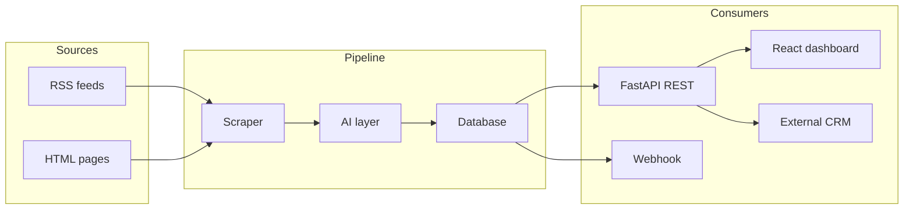

# Architecture

Throughline scrapes local newspaper sources, extracts people and summaries with AI, stores canonical contacts in PostgreSQL, and exposes a CRM-ready REST API with a React dashboard.

## System overview



## Data flow

### 1. Scrape

`src/pipeline/runner.py` reads `config/newspapers.yaml` and dispatches each enabled source to `src/scraper/` (RSS or HTML). Articles are deduplicated by URL and stored in the `articles` table.

### 2. Extract & summarize

For each new article:

1. **Summarize** — OpenAI generates a concise local-news brief (`src/ai/summarizer.py`).
2. **Extract names** — Multiple strategies merge into one person list (`src/ai/name_extractor.py`):
   - Headline parsing (including obituaries)
   - Bylines (opinion/editorial only)
   - spaCy NER (`PERSON` entities)
   - OpenAI structured extraction
3. **Score confidence** — Source count and type determine auto-review status (`src/ai/name_confidence.py`).

### 3. Deduplicate contacts

`src/database/contacts.py` maintains canonical **contacts** (one row per person) and **person_mentions** (one row per article mention). Fuzzy name matching merges variants like "Bob Smith" and "Robert Smith". Manually edited names are protected from overwrite during future scrapes.

### 4. Serve

- **REST API** (`src/api/server.py`) — articles, people, review, export, scrape triggers.
- **Dashboard** — built React app served from `static/` when present.
- **Webhooks** (`src/crm/webhook.py`) — optional push on new articles.

## Database schema

```
articles
  └── person_mentions ──► contacts
```

| Table | Role |
|-------|------|
| `articles` | Scraped article with AI summary |
| `contacts` | Canonical person (`full_name`, `name_key`, `review_status`) |
| `person_mentions` | Per-article mention with role, confidence, sources |
| `people` | Legacy per-article rows (migrated on startup) |
| `pipeline_runs` | Background scrape/reprocess job tracking |
| `scrape_logs` | Per-source scrape audit trail |

### Review workflow

| Status | Meaning |
|--------|---------|
| `pending` | Needs human review (low confidence or single source) |
| `confirmed` | Approved for CRM export |
| `rejected` | Hidden from default lists |

Users can confirm, reject, bulk-review, or rename contacts from the dashboard.

## Background jobs

Long-running work (scrape, name re-extraction) runs in background threads (`src/pipeline/background.py`) with status polled via `/api/v1/scrape/status` and `/api/v1/reprocess/status`. This avoids HTTP timeouts on Railway and similar platforms.

## Scheduling

APScheduler runs a daily scrape inside the API process (`src/pipeline/scheduler.py`). Configure via `SCRAPE_SCHEDULE_*` env vars (default: 6:00 AM Alaska time).

## Configuration

| Layer | File / env |
|-------|------------|
| Newspaper sources | `config/newspapers.yaml` |
| Secrets & DB | `.env` |
| Runtime settings | `src/config.py` (`Settings`) |

## Key design decisions

- **Contacts over flat people** — CRM integrations need one record per person across many articles.
- **Multi-source name extraction** — No single NER method is reliable on local news; merging reduces false negatives.
- **Human review queue** — Low-confidence extractions surface for confirmation before export.
- **SPA from API** — Single deploy artifact on Railway; frontend build copied to `static/` in Docker.
